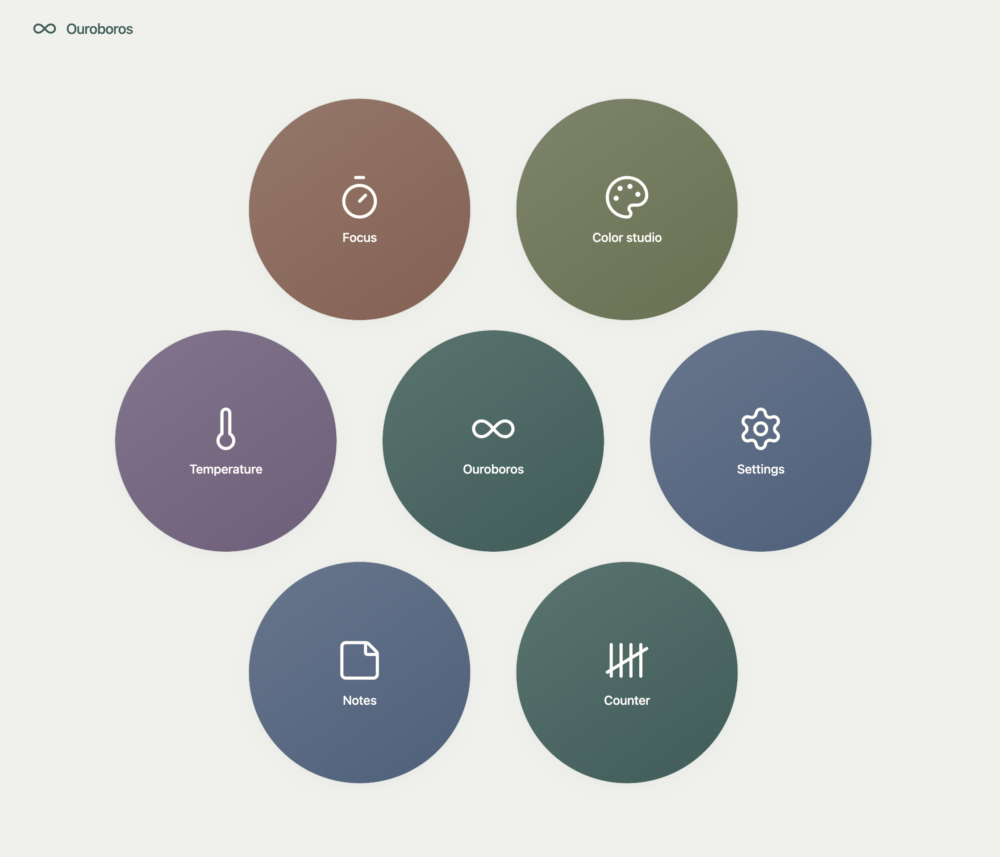
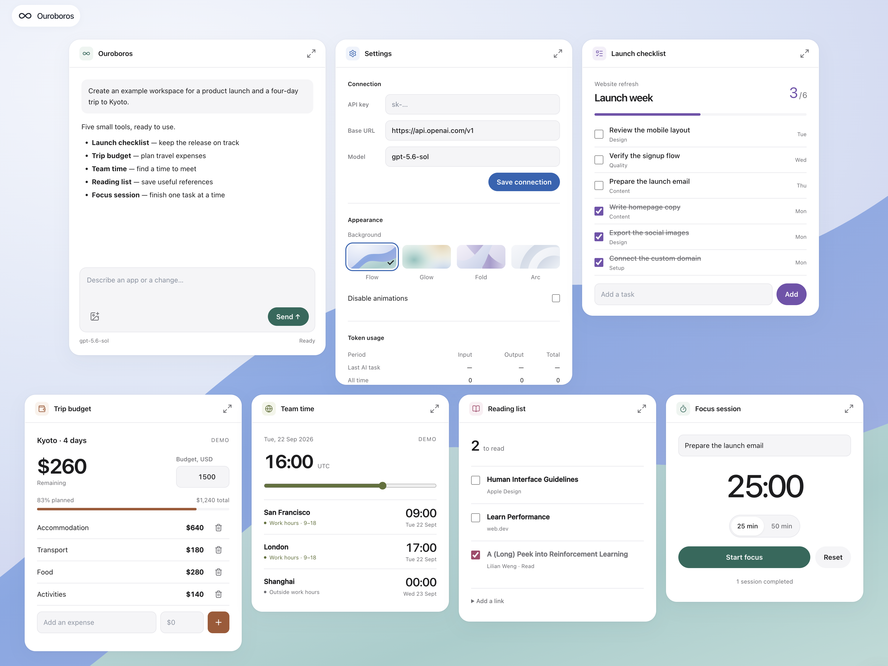
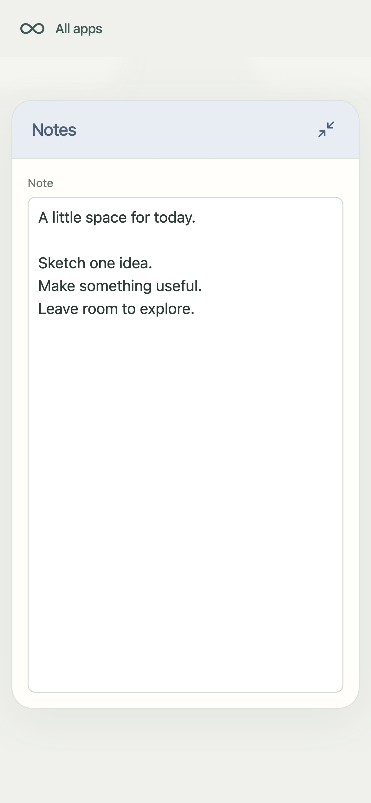

# Ouroboros

Ouroboros is an AI workspace in a single HTML file that turns natural language instructions into interactive apps on a zoomable canvas.

The `codex/watch-app-map` branch experiments with an app map and an expanded desktop view.

[Usage and app contract](docs/usage.md)

Earlier desktop examples

These screenshots show the earlier desktop UI.

